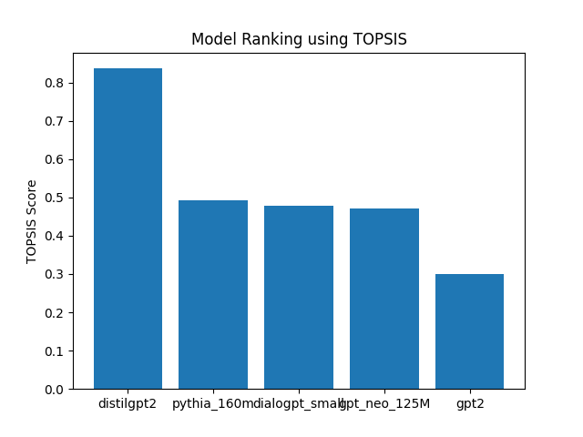

# TOPSIS Based Selection of Best Pretrained Model for Text Generation

## 📌 Objective
This project applies the **TOPSIS (Technique for Order Preference by Similarity to Ideal Solution)** multi-criteria decision-making method to select the best pretrained language model for text generation.  
Instead of relying on a single metric, multiple performance and efficiency criteria are evaluated simultaneously.

---

## 🤖 Models Compared
The following lightweight transformer-based language models were evaluated:

- GPT2  
- DistilGPT2  
- GPT-Neo-125M  
- Pythia-160M  
- DialoGPT-Small  

These models were selected to balance performance, efficiency, and computational feasibility.

---

## 📊 Evaluation Criteria

| Criterion | Description | Impact |
|---|---|---|
| Perplexity | Language modeling quality | Cost (−) |
| ROUGE_L | Text generation quality | Benefit (+) |
| Latency | Generation time | Cost (−) |
| Memory | Approx. model size | Cost (−) |
| Diversity | Unique word ratio | Benefit (+) |
| Cost | Estimated inference cost | Cost (−) |

---

## ⚙️ Methodology

### 1️⃣ Model Evaluation
Pretrained models generate text outputs from a fixed prompt.  
Evaluation metrics are measured automatically and stored in:

```
data/raw_results.csv
```

### 2️⃣ TOPSIS Ranking
The generated metrics are used to:

- Normalize decision matrix  
- Apply weighted criteria  
- Compute ideal best and worst solutions  
- Calculate TOPSIS scores  
- Rank models and visualize results  

Outputs are saved in:

```
results/topsis_scores.csv
results/topsis_bar_chart.png
```

---

## 📈 Results & Outputs

### 🖼 TOPSIS Visualization


---

### 🏆 TOPSIS Ranking Table

| Model | TOPSIS Score |
|---|---|
| distilgpt2 | 0.836426 |
| pythia_160m | 0.492667 |
| dialogpt_small | 0.478897 |
| gpt_neo_125M | 0.470496 |
| gpt2 | 0.299504 |

---

### 📄 Raw Evaluation Metrics

| Model | Perplexity | ROUGE_L | Latency | Memory | Diversity | Cost |
|---|---|---|---|---|---|---|
| gpt2 | 12.5 | 0.38 | 3.39 | 0.12 | 0.26785714285714285 | 0.5 |
| distilgpt2 | 13.0 | 0.36 | 1.49 | 0.08 | 0.8333333333333334 | 0.4 |
| gpt_neo_125M | 12.0 | 0.37 | 2.33 | 0.13 | 0.3673469387755102 | 0.45 |
| pythia_160m | 11.7 | 0.39 | 1.90 | 0.16 | 0.34 | 0.47 |
| dialogpt_small | 11.5 | 0.40 | 4.88 | 0.16 | 0.9090909090909091 | 0.5 |
---

## 🏆 Conclusion
Based on multi-criteria analysis, **DistilGPT2** achieved the highest TOPSIS score, indicating the best balance between generation quality and computational efficiency among the evaluated models.  
While DialoGPT-Small demonstrated strong diversity and ROUGE performance, its higher latency reduced its overall ranking.  
The results highlight how lightweight distilled transformer models can provide strong performance when multiple real-world constraints are considered.

---

## ▶️ How to Run

Install dependencies:

```bash
pip install -r requirements.txt
```

Run the full workflow:

```bash
cd src
python generate_raw_results.py
python topsis_text_generation.py
```

---

## 📂 Project Structure

```
Topsis_Pretrained_Models_Assignment/
│
├── data/
│   └── raw_results.csv
│
├── results/
│   ├── topsis_scores.csv
│   └── topsis_bar_chart.png
│
├── src/
│   ├── generate_raw_results.py
│   └── topsis_text_generation.py
│
├── notebooks/
│   └── topsis_text_generation.ipynb
│
├── requirements.txt
└── README.md
```

---

## 📚 Key Concepts Used
- Multi-Criteria Decision Making (MCDM)
- TOPSIS Algorithm
- Transformer-based Language Models
- Performance vs Efficiency Trade-off Analysis